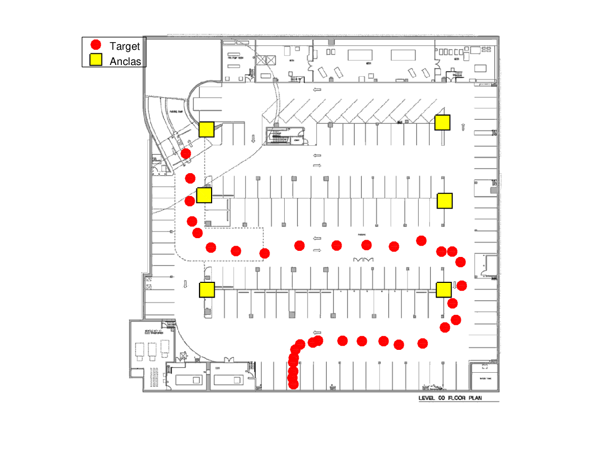

#tp MSE sed 24 pslavkin

> algoritmo de trilateracion



coordenadas obtenidas:

```
15.21925526533291,32.00918700897128
16.40876277097596,38.66913749223918
16.28078506267808,44.79107344494741
16.89322670365501,50.24233333245057
18.36690024524843,53.36705109687421
21.97372034620457,57.27598966340724
28.69915026646563,58.21272637743459
36.42087318002692,58.84648251921979
45.79485695358686,56.7610860341467
55.78965498705905,56.72743968819023
63.82270454734859,56.608818224803
71.2108320370461,57.01276138028098
78.5686765145586,55.43181184867401
83.97062845252319,58.36197621958842
86.87235974549644,58.35863259872994
89.10946132887365,61.17726923185592
89.43735297809231,67.53562338877907
86.95714424475577,72.27110399842664
87.87188180808648,76.72825786210265
84.91798428853014,78.75472360719957
78.92519421944957,83.05747533949841
72.5193186632583,83.40567325814109
68.4159218990321,82.43590241775036
62.58365133996526,82.42743378119772
57.37214095668386,82.34171306572938
50.77328241333869,82.2894074086467
49.40037850693118,82.80394186302934
45.96644610012264,83.32391507128526
44.69821491505635,84.71054706829891
44.2604137918204,86.90651442064392
44.09488557438494,88.13844956104001
44.10954268753092,90.53693972553691
43.89838176462948,92.30584464843336
44.17474129726678,94.01302053142139
```

archivos:
```
.
├── mapa.png
├── p3_25630214.m
├── plotloc.m
├── practica3.mat
├── README.md
└── resultados_25630214.csv
```
